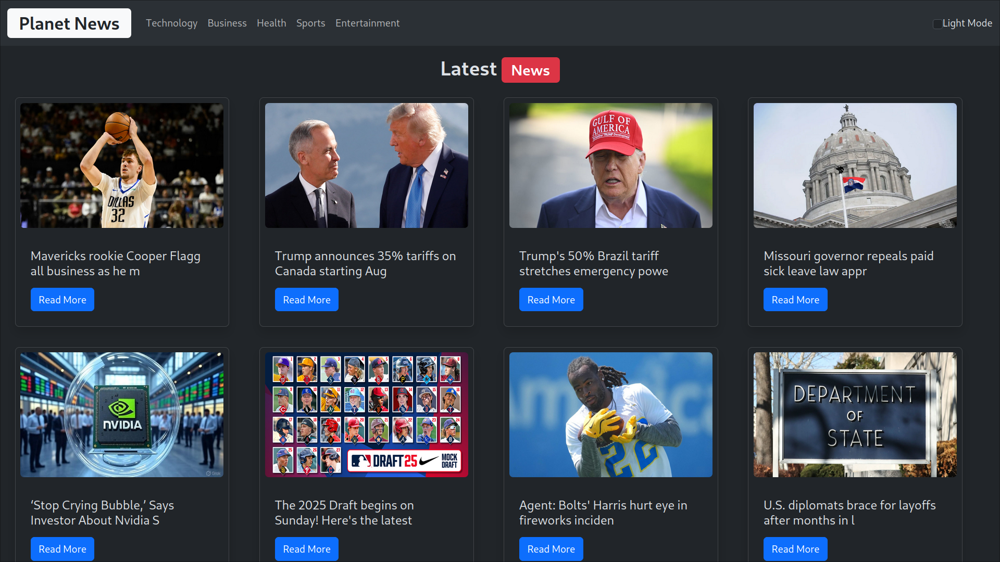

# 🌍 PlanetNews


[](https://reactjs.org)  
[](https://vitejs.dev)  
[](https://getbootstrap.com)  


---

##  Overview

PlanetNews brings the latest global headlines to your screen with sleek styling and user-friendly features:

- Fetches real-time news using the [NewsAPI](https://newsapi.org/).
- Browse by category (e.g. general, tech, sports, business…).
- Toggle **Dark Mode** for low‑light preferences.
- Built with modern React + Vite stack, styled via Bootstrap for a clean and responsive UI.

---

##  Tech Stack

| Technology       | Purpose                                  |
|------------------|------------------------------------------|
| React (with Hooks) | Frontend UI & state management         |
| Vite             | Fast build + dev server with HMR         |
| Bootstrap 5      | UI components and responsive styling      |
| NewsAPI.org      | Fetch latest news headlines & metadata   |
| CSS             | Theming & Dark Mode toggle               |

---

##  Preview




---

##  Getting Started

### Prerequisites

- Node.js (v14+)
- NewsAPI API key (signup at [newsapi.org](https://newsapi.org) and get a free key)

### Setup Steps

1. Clone the project:
   ```bash
   git clone https://github.com/UjjwalOnGit/PlanetNews.git
   cd PlanetNews
   ```
2. Install dependencies:
   ```bash
   npm install
   ```
3. Setup your `.env` (in project root):
   ```env
   VITE_NEWS_API_KEY=your_api_key_here
   ```
4. Start the dev server:
   ```bash
   npm run dev
   ```
   Visit `http://localhost:5173/` (Open browser or link from CLI).

---

##  Features

-  **Category Filter**: Select topics like Tech, Business, Entertainment, and more.
-  **Dark Mode Toggle**: Switch themes on demand.
-  **Live Updates**: News updates dynamically based on selection.

---

##  Folder Structure

```
PlanetNews/
├── public/
│   └── index.html
├── src/
│   ├── components/
│   │   ├── Navbar.jsx
│   │   ├── NewsList.jsx
│   │   ├── NewsItem.jsx
│   │   └── DarkModeToggle.jsx
│   ├── App.jsx
│   ├── main.jsx
│   └── styles.css
├── .env
├── vite.config.js
├── package.json
├── screenshot.png
└── README.md
```

---

##  Contributing

Pull requests, feature suggestions, or theme improvements are welcome:

- Fork the repo
- Work on a branch (`git checkout -b feature‑xyz`)
- Submit a PR with changes
- Keep code clean and add comments if needed

---


## 👨‍💻 Author

Made with ❤️ by [Ujjwal Singh](https://github.com/UjjwalOnGit) 